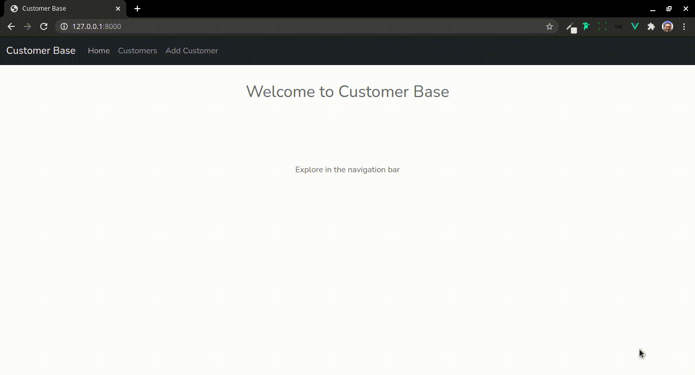

## Customer Base

 

Sistema web para cadastro de clientes usando Vue.js para o frontend, PHP Laravel, MySQL, e PDO para comunicação com o Banco de Dados.

 

> Para executar o projeto

1) Criar na raiz do projeto o aquivo `.env`
2) Copiar o conteúdo do `.env.example` file to `.env`
3) Editar as credenciais do banco de dados no `.env`
4) Executar `composer install`
5) Executar `php artisan key:generate`
6) Executar `php artisan migrate`
7) Executar `php artisan serve`

 

